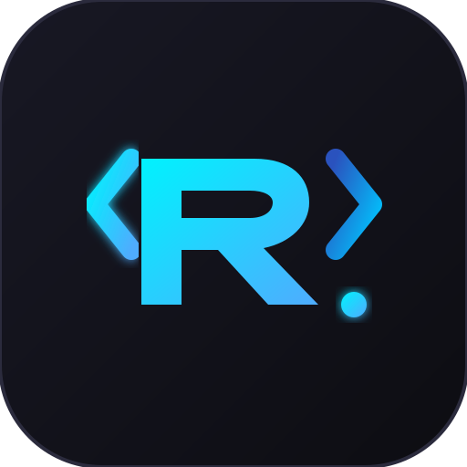

  

<h1 align="center">RGS.Code</h1>

# 🚀 RGS.Code

> Un entorno de desarrollo web moderno, rápido y minimalista inspirado en VS Code, equipado con herramientas avanzadas y consola P2P integrada. Desarrollado por **RGS Labs**.

---

## ✨ Características Principales
* **Interfaz Inspirada en VS Code:** Una experiencia de edición familiar, oscura y optimizada para la productividad.
* **Terminal P2P Integrada:** Conexión y consola en tiempo real para comunicación directa entre pares.
* **Diseño Ligero y Web-First:** Funciona directamente desde el navegador gracias a GitHub Pages.
* **Arquitectura Limpia:** Construido con tecnologías web modernas y optimizado para desarrolladores.

---

## 🛠️ Tecnologías Utilizadas
* **HTML5 / CSS3 / JavaScript (ES6+)**
* **WebSockets / WebRTC** (para la infraestructura P2P)
* **GitHub Pages** (Hosting y despliegue)

---

## 🚀 Uso en Vivo
Puedes probar la aplicación directamente en la web a través de su despliegue oficial:
👉 [Enlace a RGS.Code en GitHub Pages](https://tu-usuario.github.io/rgs-code/)

---

## 📄 Licencia y Derechos de Autor
© 2026 **RGS Labs**. Todos los derechos reservados. 
Este software es una obra propietaria. Queda prohibida su reproducción, distribución o modificación sin la autorización expresa de los creadores.

---
*Construido con pasión por el equipo de RGS Labs.*
